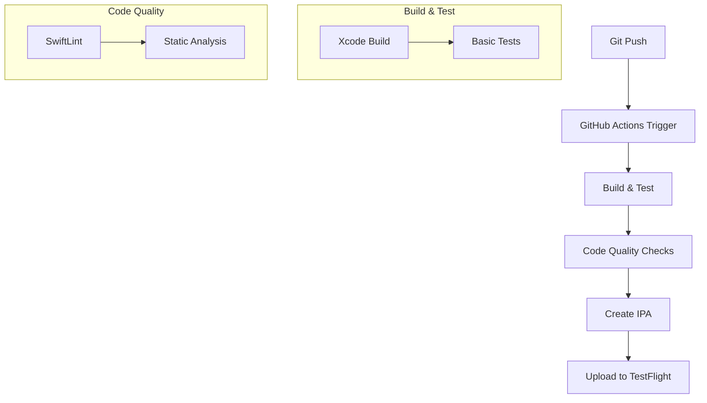

# CI/CD Pipeline for Taco Bell Distance App

This document outlines the Continuous Integration and Continuous Deployment (CI/CD) pipeline for the Taco Bell Distance iOS app using GitHub Actions.

## Pipeline Overview



## 1. Setting Up GitHub Actions

### 1.1 Create Workflow File
Create a new file at `.github/workflows/ios.yml` with the following content:

```yaml
name: iOS CI/CD

on:
  push:
    branches: [ main ]
  pull_request:
    branches: [ main ]
  workflow_dispatch:  # Allows manual trigger

jobs:
  build_and_test:
    runs-on: macos-latest
    
    steps:
    - uses: actions/checkout@v2
    
    - name: Select Xcode
      run: sudo xcode-select -switch /Applications/Xcode.app
    
    - name: Build
      run: |
        xcodebuild clean build \
          -scheme "TacoBellApp" \
          -destination "platform=iOS Simulator,name=iPhone 14"
```

## 2. Required Secrets

Add these secrets in GitHub repository settings (Settings > Secrets):

- `APPLE_DEVELOPER_ID`: Your Apple Developer ID
- `APPLE_DEVELOPER_PASSWORD`: Your Apple Developer Password
- `MATCH_PASSWORD`: Password for certificate encryption
- `MATCH_GIT_BASIC_AUTHORIZATION`: Base64 encoded Git credentials

## 3. Implementing SwiftLint

### 3.1 Install SwiftLint
Add a `.swiftlint.yml` file to your project root:

```yaml
disabled_rules:
  - trailing_whitespace
opt_in_rules:
  - empty_count
  - missing_docs
excluded:
  - Carthage
  - Pods
```

### 3.2 Add SwiftLint to Build Phase
Add a new "Run Script" build phase in Xcode:
```bash
if which swiftlint >/dev/null; then
  swiftlint
else
  echo "warning: SwiftLint not installed"
fi
```

## 4. TestFlight Deployment

### 4.1 Fastlane Setup
1. Install Fastlane:
```bash
brew install fastlane
```

2. Create a Fastfile:
```ruby
default_platform(:ios)

platform :ios do
  desc "Push a new beta build to TestFlight"
  lane :beta do
    increment_build_number
    build_app(scheme: "TacoBellApp")
    upload_to_testflight
  end
end
```

### 4.2 Add Fastlane to GitHub Actions
Add these steps to your workflow:

```yaml
    - name: Deploy to TestFlight
      env:
        FASTLANE_APPLE_APPLICATION_SPECIFIC_PASSWORD: ${{ secrets.APPLE_APP_SPECIFIC_PASSWORD }}
      run: |
        fastlane beta
```

## 5. Version Management

### 5.1 Automatic Version Bumping
Add to your Fastfile:
```ruby
  lane :bump_version do
    increment_version_number(
      bump_type: "patch" # or "minor" or "major"
    )
  end
```

## 6. Step-by-Step Implementation Guide

1. **Initial Setup**
   - Push your code to GitHub
   - Create a new Apple Developer account if you haven't already
   - Enable GitHub Actions in your repository

2. **Configure GitHub Repository**
   - Go to Settings > Secrets
   - Add all required secrets listed in Section 2
   - Enable GitHub Actions under Settings > Actions

3. **Local Development Setup**
   - Install Xcode command line tools:
     ```bash
     xcode-select --install
     ```
   - Install SwiftLint:
     ```bash
     brew install swiftlint
     ```
   - Install Fastlane:
     ```bash
     brew install fastlane
     ```

4. **First Deployment**
   - Create a new commit
   - Push to main branch
   - Monitor the Actions tab in GitHub
   - Check TestFlight for the new build

## 7. Troubleshooting

Common issues and solutions:

1. **Build Failures**
   - Check Xcode scheme name matches workflow file
   - Verify all certificates are properly set up
   - Ensure all dependencies are properly installed

2. **TestFlight Upload Issues**
   - Verify Apple Developer account credentials
   - Check app bundle identifier matches
   - Ensure version and build numbers are incremented

3. **SwiftLint Errors**
   - Run SwiftLint locally first
   - Check .swiftlint.yml configuration
   - Verify excluded paths are correct

## 8. Best Practices

1. **Commit Messages**
   - Use clear, descriptive commit messages
   - Include ticket/issue numbers if applicable
   - Follow a consistent format

2. **Branch Management**
   - Create feature branches for new work
   - Use pull requests for code review
   - Delete branches after merging

3. **Version Control**
   - Tag releases with version numbers
   - Use semantic versioning (MAJOR.MINOR.PATCH)
   - Document significant changes in release notes

## 9. Maintenance

Regular maintenance tasks:

1. **Weekly**
   - Review and update dependencies
   - Check certificate expiration dates
   - Monitor build times and optimization opportunities

2. **Monthly**
   - Review and update SwiftLint rules
   - Clean up old TestFlight builds
   - Update documentation as needed

3. **Quarterly**
   - Review and update Xcode version
   - Audit GitHub Actions workflow
   - Review and update fastlane configuration

## Need Help?

If you encounter any issues:
1. Check GitHub Actions logs
2. Review Apple Developer console
3. Verify all credentials and certificates
4. Consult the troubleshooting section above
